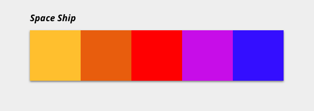

## Ejercicio de repaso módulo 2 - Paletas 

### Planteamiento

Vamos a sacar a la diseñadora que llevamos dentro: queremos pintar **paletas** que podríamos usar en diferentes páginas web, y como somos unas freaks pues a cada paleta le ponemos nombres de naves espaciales de películas, a lo loco.

Usaremos la URL (https://beta.adalab.es/ejercicios-extra/js-ejercicio-de-paletas/data/palettes.json) de una **API** que nos devolverá datos de las paletas, las cuales debemos pintar en la página siguiendo este modelo:

Una vez las tengas todas pintadas vamos a permitir que la usuaria seleccione sus **paletas preferidas**. Al hacer clic en cualquiera de ellas tenemos que añadirle alguna clase que la marque como seleccionada. Como hay mucha gente a la que le cuesta decidir dejaremos que marquen como preferidas tantas paletas como quieran.

Ahora vamos a dejar que la usuaria **filtre** por nombre de nave, para ello tenemos que añadir una caja de búsqueda. Cada vez que se escriba una letra filtraremos. Si la usuaria escribe 'a' solo pintaremos las naves cuyo nombre contengan 'a', si escribe 'ac' as que contengan 'ac'. Y así!

Estamos haciendo muchas peticiones al servidor cada vez que alguien visita la web. Y hemos visto que muchas veces es una usuaria que ya la visitó antes. Vamos a cachear la respuesta de nuestro fetch en **localStorage**. La idea es que al cargar la página podamos consultar el LS, si ya están las paletas guardadas las pintamos directamente y nos ahorramos una petición. Sino hacemos nuestro fetch ;)

### Pasos a seguir:

- [x] Pintar una paleta
  - [x] Fetch: obtener datos del server
  - [x] Parsear: transformar los datos del server
  - [x] Pintar la paleta en HTML
- [x] Darle estilos en CSS
- [x] Pintar varias paletas
- [] Marcar la paleta seleccionada por la usuaria como favorita
  - [x] Escuchar el evento click sobre cada nave
  - [x] Identificar el elemento clickado
  - [x] Guardar los favoritos en un array
  - [] Añadir la clase de favorito
  - [] Quitar la clase de favorito
- [] Filtrar paletas por nombre
- [x] Cachear las paletas en el navegador con localStorage